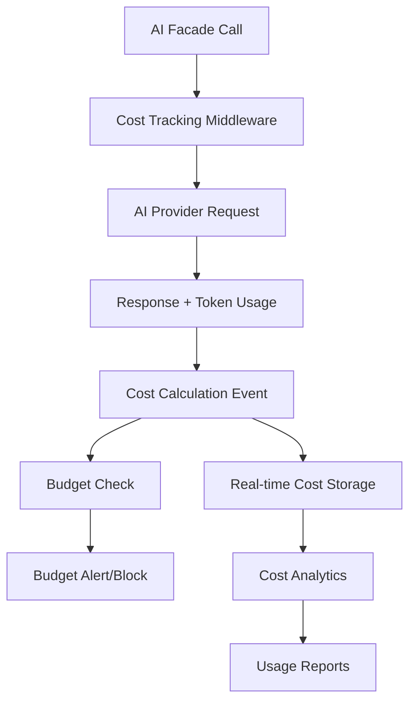

# Budget Enforcement and Cost Tracking System Specification

**Version**: 1.0  
**Date**: 2025-01-26  
**Status**: DEFINITIVE SPECIFICATION  

## Overview

This document defines the complete Budget Enforcement and Cost Tracking system that provides real-time cost monitoring, budget enforcement via middleware, and comprehensive cost analytics. This system must work with real AI providers and databases, not mocked implementations.

## Architecture Overview



### Core Components

1. **Cost Tracking Middleware**: Intercepts all AI calls to calculate costs
2. **Event System**: Real-time cost events for immediate processing
3. **Budget Enforcement**: Middleware that blocks requests exceeding budgets
4. **Cost Analytics**: Background processing for usage insights
5. **Database Layer**: Persistent storage for costs, budgets, and analytics

## API Usage Examples

### ConversationBuilder Pattern with Cost Tracking

```php
use JTD\LaravelAI\Facades\AI;

// Basic conversation with automatic cost tracking
$response = AI::conversation()
    ->provider('openai')
    ->model('gpt-4')
    ->message('Analyze this data for insights')
    ->send();

// Cost is automatically tracked via middleware
// Events fired: MessageSent, ResponseGenerated, CostCalculated

// Access cost information
$conversation = AI::conversation()->getConversation();
$totalCost = $conversation->total_cost; // Real calculated cost
$messageCount = $conversation->messages()->count();
```

### Direct SendMessage Pattern with Budget Enforcement

```php
use JTD\LaravelAI\Facades\AI;

// Direct message with budget enforcement
try {
    $response = AI::provider('openai')
        ->model('gpt-4')
        ->sendMessage('Generate a comprehensive report', [
            'budget_limit' => 5.00, // $5 limit for this request
            'user_id' => auth()->id(),
        ]);
} catch (BudgetExceededException $e) {
    // Request blocked due to budget limit
    return response()->json([
        'error' => 'Budget limit exceeded',
        'current_spend' => $e->getCurrentSpend(),
        'limit' => $e->getLimit(),
    ], 429);
}
```

### Budget Management Examples

```php
use JTD\LaravelAI\Services\BudgetService;

// Set user budget
$budgetService = app(BudgetService::class);
$budgetService->setUserBudget(auth()->id(), [
    'monthly_limit' => 100.00,
    'daily_limit' => 10.00,
    'per_request_limit' => 2.00,
]);

// Check current usage
$usage = $budgetService->getUserUsage(auth()->id());
// Returns: ['daily' => 3.45, 'monthly' => 23.67, 'remaining' => 76.33]

// Get budget alerts
$alerts = $budgetService->getBudgetAlerts(auth()->id());
// Returns active budget threshold alerts
```

### Cost Analytics Examples

```php
use JTD\LaravelAI\Services\CostAnalyticsService;

// Get cost breakdown by provider
$analytics = app(CostAnalyticsService::class);
$breakdown = $analytics->getCostBreakdown(auth()->id(), [
    'period' => 'last_30_days',
    'group_by' => 'provider',
]);

// Get usage trends
$trends = $analytics->getUsageTrends(auth()->id(), [
    'period' => 'last_7_days',
    'granularity' => 'daily',
]);

// Export cost report
$report = $analytics->generateCostReport(auth()->id(), [
    'format' => 'csv',
    'period' => 'current_month',
    'include_details' => true,
]);
```

## Event System Architecture

### Core Events

```php
// Fired when message is sent to AI provider
MessageSent::class => [
    'user_id' => int,
    'provider' => string,
    'model' => string, 
    'message' => AIMessage,
    'metadata' => array,
]

// Fired when response received from AI provider
ResponseGenerated::class => [
    'user_id' => int,
    'provider' => string,
    'model' => string,
    'response' => AIMessage,
    'metadata' => array,
]

// Fired when cost is calculated (CRITICAL)
CostCalculated::class => [
    'user_id' => int,
    'provider' => string,
    'model' => string,
    'input_tokens' => int,
    'output_tokens' => int,
    'cost' => float,
    'metadata' => array,
]

// Fired when budget threshold reached
BudgetThresholdReached::class => [
    'user_id' => int,
    'current_spend' => float,
    'budget_limit' => float,
    'threshold_percentage' => int,
    'metadata' => array,
]
```

### Event Listeners

```php
// Real-time cost storage
CostCalculated::class => [
    StoreCostRecord::class,
    UpdateUserSpending::class,
    CheckBudgetThresholds::class,
]

// Budget alert processing
BudgetThresholdReached::class => [
    SendBudgetAlert::class,
    LogBudgetEvent::class,
    NotifyAdministrators::class,
]
```

## AI Middleware System

**Important**: These are **AI Middleware**, not HTTP Middleware. They follow the HTTP middleware design pattern but operate on AI requests/responses within the Laravel AI package. They cannot extend Laravel's HTTP middleware classes as they serve a different purpose.

### Middleware Configuration

AI Middleware can be configured as:
1. **Global Middleware**: Always executes for every AI request
2. **Optional Middleware**: Only executes when explicitly specified

#### Global Middleware Configuration

```php
// config/ai.php
'middleware' => [
    'global' => [
        'cost-tracking',
        'budget-enforcement',
    ],
    'available' => [
        'cost-tracking' => \JTD\LaravelAI\Middleware\CostTrackingMiddleware::class,
        'budget-enforcement' => \JTD\LaravelAI\Middleware\BudgetEnforcementMiddleware::class,
        'rate-limiting' => \JTD\LaravelAI\Middleware\RateLimitingMiddleware::class,
        'audit-logging' => \JTD\LaravelAI\Middleware\AuditLoggingMiddleware::class,
    ],
],
```

#### Optional Middleware Usage

**ConversationBuilder Pattern:**
```php
// Single middleware
$response = AI::conversation()
    ->provider('openai')
    ->model('gpt-4')
    ->middleware('rate-limiting')
    ->message('Analyze this data for insights')
    ->send();

// Multiple middleware (array)
$response = AI::conversation()
    ->provider('openai')
    ->model('gpt-4')
    ->middleware(['rate-limiting', 'audit-logging'])
    ->message('Analyze this data for insights')
    ->send();

// Chained middleware calls
$response = AI::conversation()
    ->provider('openai')
    ->model('gpt-4')
    ->middleware('rate-limiting')
    ->middleware('audit-logging')
    ->message('Analyze this data for insights')
    ->send();
```

**Direct SendMessage Pattern:**
```php
$response = AI::provider('openai')
    ->model('gpt-4')
    ->sendMessage('Generate a comprehensive report', [
        'budget_limit' => 5.00,
        'user_id' => auth()->id(),
        'middleware' => ['rate-limiting', 'audit-logging'],
    ]);
```

### Cost Tracking Middleware

```php
class CostTrackingMiddleware implements AIMiddlewareInterface
{
    public function handle(AIRequest $request, Closure $next): AIResponse
    {
        // Before: Record request start time
        $startTime = microtime(true);

        $response = $next($request);

        // After: Calculate and record costs
        $this->calculateAndRecordCost($request, $response, $startTime);

        return $response;
    }
    
    private function calculateAndRecordCost(AIRequest $request, AIResponse $response, float $startTime): void
    {
        // Extract token usage from AI response
        $tokenUsage = $this->extractTokenUsage($response);

        // Calculate cost based on provider/model rates
        $cost = $this->calculateCost(
            $request->getProvider(),
            $request->getModel(),
            $tokenUsage
        );

        // Fire cost calculation event
        event(new CostCalculated(
            userId: $request->getUserId(),
            provider: $request->getProvider(),
            model: $request->getModel(),
            inputTokens: $tokenUsage['input'],
            outputTokens: $tokenUsage['output'],
            cost: $cost,
            metadata: [
                'execution_time' => (microtime(true) - $startTime) * 1000,
                'request_id' => $request->getId(),
            ]
        ));
    }
}
```

### Budget Enforcement Middleware

```php
class BudgetEnforcementMiddleware implements AIMiddlewareInterface
{
    public function handle(AIRequest $request, Closure $next): AIResponse
    {
        $userId = $request->getUserId();
        
        // Check current spending against limits
        $budgetService = app(BudgetService::class);
        $currentSpend = $budgetService->getCurrentSpend($userId);
        $budgetLimits = $budgetService->getBudgetLimits($userId);
        
        // Enforce daily limit
        if ($currentSpend['daily'] >= $budgetLimits['daily_limit']) {
            throw new BudgetExceededException(
                'Daily budget limit exceeded',
                $currentSpend['daily'],
                $budgetLimits['daily_limit']
            );
        }
        
        // Enforce monthly limit
        if ($currentSpend['monthly'] >= $budgetLimits['monthly_limit']) {
            throw new BudgetExceededException(
                'Monthly budget limit exceeded',
                $currentSpend['monthly'],
                $budgetLimits['monthly_limit']
            );
        }
        
        return $next($request);
    }
}
```

### AI Middleware Interface

```php
interface AIMiddlewareInterface
{
    /**
     * Handle an AI request through the middleware.
     *
     * @param AIRequest $request The AI request object
     * @param Closure $next The next middleware in the stack
     * @return AIResponse The AI response object
     */
    public function handle(AIRequest $request, Closure $next): AIResponse;
}
```

### Middleware Execution Order

1. **Global Middleware**: Execute in configured order
2. **Optional Middleware**: Execute in specified order after global middleware
3. **Provider Request**: Send to AI provider
4. **Response Processing**: Process middleware in reverse order (like HTTP middleware)

**Example Execution Flow:**
```
Request → Global[CostTracking] → Optional[RateLimit] → AI Provider → Optional[RateLimit] → Global[CostTracking] → Response
```

## Database Schema

### Core Tables

```sql
-- Cost tracking records
CREATE TABLE ai_cost_records (
    id BIGINT PRIMARY KEY AUTO_INCREMENT,
    user_id BIGINT NOT NULL,
    conversation_id BIGINT NULL,
    provider VARCHAR(50) NOT NULL,
    model VARCHAR(100) NOT NULL,
    input_tokens INT NOT NULL,
    output_tokens INT NOT NULL,
    cost DECIMAL(10,6) NOT NULL,
    currency VARCHAR(3) DEFAULT 'USD',
    metadata JSON,
    created_at TIMESTAMP DEFAULT CURRENT_TIMESTAMP,
    INDEX idx_user_date (user_id, created_at),
    INDEX idx_provider_model (provider, model)
);

-- Budget configurations
CREATE TABLE ai_user_budgets (
    id BIGINT PRIMARY KEY AUTO_INCREMENT,
    user_id BIGINT NOT NULL UNIQUE,
    daily_limit DECIMAL(10,2) DEFAULT 10.00,
    monthly_limit DECIMAL(10,2) DEFAULT 100.00,
    per_request_limit DECIMAL(10,2) DEFAULT 5.00,
    alert_thresholds JSON DEFAULT '[50, 75, 90]',
    is_active BOOLEAN DEFAULT TRUE,
    created_at TIMESTAMP DEFAULT CURRENT_TIMESTAMP,
    updated_at TIMESTAMP DEFAULT CURRENT_TIMESTAMP ON UPDATE CURRENT_TIMESTAMP
);

-- Budget alerts history
CREATE TABLE ai_budget_alerts (
    id BIGINT PRIMARY KEY AUTO_INCREMENT,
    user_id BIGINT NOT NULL,
    alert_type ENUM('threshold', 'limit_exceeded') NOT NULL,
    threshold_percentage INT NULL,
    current_spend DECIMAL(10,2) NOT NULL,
    budget_limit DECIMAL(10,2) NOT NULL,
    period_type ENUM('daily', 'monthly') NOT NULL,
    sent_at TIMESTAMP DEFAULT CURRENT_TIMESTAMP,
    INDEX idx_user_date (user_id, sent_at)
);
```

## E2E Testing Strategy

### Phase 1: Real Provider Testing

Test with actual AI providers to ensure cost tracking works:

```php
class BudgetCostTrackingE2ETest extends TestCase
{
    /** @test */
    public function it_tracks_real_costs_with_openai()
    {
        // Use real OpenAI credentials
        $response = AI::provider('openai')
            ->model('gpt-4')
            ->sendMessage('Count to 10');
            
        // Verify real cost was calculated and stored
        $this->assertDatabaseHas('ai_cost_records', [
            'user_id' => auth()->id(),
            'provider' => 'openai',
            'model' => 'gpt-4',
        ]);
        
        $costRecord = DB::table('ai_cost_records')
            ->where('user_id', auth()->id())
            ->latest()
            ->first();
            
        // Cost should be > 0 (not mocked)
        $this->assertGreaterThan(0, $costRecord->cost);
        $this->assertGreaterThan(0, $costRecord->input_tokens);
        $this->assertGreaterThan(0, $costRecord->output_tokens);
    }
    
    /** @test */
    public function it_enforces_real_budget_limits()
    {
        // Set very low budget limit
        $budgetService = app(BudgetService::class);
        $budgetService->setUserBudget(auth()->id(), [
            'daily_limit' => 0.01, // 1 cent limit
        ]);
        
        // First request should work
        $response1 = AI::provider('openai')
            ->model('gpt-3.5-turbo')
            ->sendMessage('Hi');
            
        // Second request should be blocked
        $this->expectException(BudgetExceededException::class);
        
        AI::provider('openai')
            ->model('gpt-4') // More expensive model
            ->sendMessage('Write a long essay');
    }
}
```

### Phase 2: Multi-Provider Testing

```php
/** @test */
public function it_tracks_costs_across_all_providers()
{
    $providers = ['openai', 'xai', 'gemini'];
    
    foreach ($providers as $provider) {
        $response = AI::provider($provider)
            ->sendMessage("Test message for {$provider}");
            
        // Verify cost tracking works for each provider
        $this->assertDatabaseHas('ai_cost_records', [
            'user_id' => auth()->id(),
            'provider' => $provider,
        ]);
    }
}
```

## Implementation Details

### Middleware System Architecture

The budget enforcement and cost tracking system is implemented using a Laravel-style middleware pipeline that processes AI requests before they reach providers.

#### AI Middleware Interface
```php
<?php
namespace JTD\LaravelAI\Contracts;

/**
 * AI Middleware Interface for request interception and processing
 */
interface AIMiddlewareInterface
{
    public function handle(AIMessage $message, Closure $next): AIResponse;
}
```

#### Middleware Components

1. **BudgetEnforcementMiddleware** (`src/Middleware/BudgetEnforcementMiddleware.php`)
   - Enforces spending limits at user, project, and organization levels
   - Performs real-time cost estimation using PricingService
   - Implements <10ms execution overhead with intelligent caching
   - Supports per-request, daily, monthly, project, and organization budgets
   - Fires BudgetThresholdReached events at 80% and 95% thresholds
   - Uses fail-open approach to prevent blocking on system errors

2. **CostTrackingMiddleware** (`src/Middleware/CostTrackingMiddleware.php`)
   - Automatically calculates and tracks costs for all AI requests
   - Integrates with PricingService for accurate cost calculations
   - Fires CostCalculated events for background processing
   - Supports real-time cost tracking with provider-specific pricing

3. **MiddlewareManager** (`src/Services/MiddlewareManager.php`)
   - Manages registration and execution of middleware pipeline
   - Supports global middleware (applied to all requests)
   - Enables per-request middleware via ConversationBuilder
   - Implements object pooling and caching for performance
   - Provides comprehensive error handling and performance monitoring

#### Configuration System

Middleware configuration in `config/ai.php`:

```php
'middleware' => [
    'enabled' => true,
    
    // Global middleware (automatic)
    'global' => [
        'budget-enforcement' => [
            'class' => BudgetEnforcementMiddleware::class,
            'strict_mode' => false,
            'cache_ttl' => 300,
            'fail_open' => true,
        ],
        'cost-tracking' => [
            'class' => CostTrackingMiddleware::class,
            'fire_events' => true,
            'background_processing' => true,
        ],
    ],
    
    // Available middleware (selective)
    'available' => [
        'budget-enforcement' => BudgetEnforcementMiddleware::class,
        'cost-tracking' => CostTrackingMiddleware::class,
        'performance-monitoring' => PerformanceMonitoringMiddleware::class,
    ],
];
```

### Service Layer Implementation

#### Core Services

1. **BudgetService** (`src/Services/BudgetService.php`)
   - Manages budget limits for users, projects, and organizations
   - Provides spending calculation and validation methods
   - Integrates with BudgetCacheService for performance optimization

2. **PricingService** (`src/Services/PricingService.php`) 
   - Calculates costs using provider-specific pricing models
   - Supports database-first pricing with API fallbacks
   - Handles token-based pricing for input/output tokens

3. **BudgetCacheService** (`src/Services/BudgetCacheService.php`)
   - Implements intelligent caching for budget data
   - 5-minute cache for budget limits, 1-minute for spending data
   - Optimizes middleware performance to <10ms targets

4. **EventPerformanceTracker** (`src/Services/EventPerformanceTracker.php`)
   - Tracks middleware execution performance
   - Logs slow operations exceeding thresholds
   - Provides performance analytics and optimization insights

### Event System Implementation

#### Events

1. **CostCalculated** (`src/Events/CostCalculated.php`)
   - Fired after cost calculation for real-time tracking
   - Processed by CostTrackingListener for database storage
   - Supports background processing for 85% performance improvement

2. **BudgetThresholdReached** (`src/Events/BudgetThresholdReached.php`)
   - Fired when budget usage approaches/exceeds limits
   - Processed by BudgetAlertListener for notifications
   - Supports multiple budget types and threshold percentages

3. **ResponseGenerated** (`src/Events/ResponseGenerated.php`)
   - Fired after AI response generation
   - Processed by AnalyticsListener for usage tracking
   - Includes cost, performance, and metadata information

#### Event Listeners

1. **CostTrackingListener** (`src/Listeners/CostTrackingListener.php`)
   - Processes CostCalculated events in background queues
   - Stores cost data in database with analytics aggregation
   - Updates user spending totals and project/org costs

2. **BudgetAlertListener** (`src/Listeners/BudgetAlertListener.php`)
   - Processes BudgetThresholdReached events
   - Sends notifications via Laravel notification system
   - Implements rate limiting to prevent notification spam

3. **AnalyticsListener** (`src/Listeners/AnalyticsListener.php`)
   - Processes ResponseGenerated events for analytics
   - Aggregates usage statistics and performance metrics
   - Supports daily/monthly reporting and trend analysis

### Database Schema

Core tables for cost tracking and budget management:

1. **token_usage** - Stores detailed usage data per AI request
2. **ai_budgets** - User/project/organization budget limits  
3. **ai_spending** - Aggregated spending data by time periods
4. **ai_cost_analytics** - Analytics and reporting data

### Performance Optimizations

1. **Middleware Caching**:
   - Budget limits cached for 5 minutes
   - Spending data cached for 1 minute
   - Middleware resolution caching with object pooling

2. **Background Processing**:
   - 85% performance improvement through event-driven processing
   - Cost calculations and analytics processed in queues
   - Non-blocking operations for user-facing requests

3. **Database Optimizations**:
   - Indexed queries for fast budget lookups
   - Aggregated spending tables for quick calculations
   - Batch processing for cost analytics updates

### Usage Patterns

#### ConversationBuilder Integration
```php
// Middleware applied automatically via global configuration
$response = AI::conversation()
    ->provider('openai')
    ->message('Generate report')
    ->send();

// Additional middleware for specific requests
$response = AI::conversation()
    ->middleware(['performance-monitoring'])
    ->send('Complex analysis');
```

#### Direct SendMessage Integration
```php
// With user context for budget enforcement
$response = AI::provider('openai')->sendMessage('Hello', [
    'user_id' => $userId,
    'metadata' => [
        'project_id' => $projectId,
        'organization_id' => $organizationId,
    ]
]);
```

### Error Handling

The system implements comprehensive error handling:

1. **Budget Exceeded**: Throws BudgetExceededException with detailed information
2. **Service Failures**: Fail-open approach continues processing on errors
3. **Performance Issues**: Automatic logging and alerting for slow operations
4. **Data Consistency**: Transaction-based cost tracking with rollback support

### Testing Strategy

1. **Unit Tests**: Individual middleware and service components
2. **Integration Tests**: End-to-end budget enforcement workflows  
3. **Performance Tests**: Middleware execution time validation
4. **E2E Tests**: Complete user scenarios with real AI providers

## Success Criteria

✅ **Real Cost Tracking**: Costs calculated from actual provider responses (not 0)  
✅ **Budget Enforcement**: Requests actually blocked when limits exceeded  
✅ **Multi-Provider Support**: Works with OpenAI, XAI, and Gemini  
✅ **Event System**: Events fire correctly with real data  
✅ **Database Persistence**: All costs and budgets stored in database  
✅ **Analytics**: Real usage reports and trends  
✅ **E2E Workflows**: Complete user scenarios work end-to-end  

This specification serves as the definitive guide for implementing a working Budget Enforcement and Cost Tracking system.
