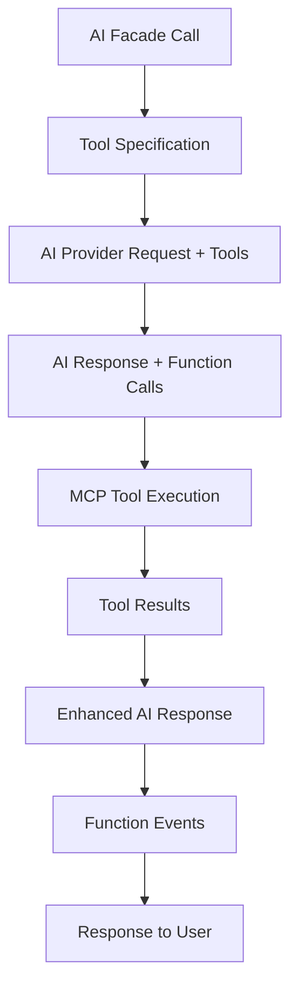

# Unified Tool System Specification

**Version**: 1.0  
**Date**: 2025-01-26  
**Status**: DEFINITIVE SPECIFICATION  
**Based on**: UNIFIED_TOOL_SYSTEM_INTEGRATION_REPORT.md (Correct API Patterns)

## Overview

This document defines the complete Unified Tool System that integrates MCP (Model Context Protocol) servers with AI function calling. This system enables AI providers to execute tools and functions seamlessly, with proper event handling and response integration.

## Architecture Overview



### Core Components

1. **MCP Server Management**: Discovery, configuration, and lifecycle management
2. **Tool Integration**: Seamless tool specification in AI calls
3. **Function Execution**: Real-time tool execution during AI conversations
4. **Event System**: Function call events for monitoring and analytics
5. **Response Enhancement**: Tool results integrated into AI responses

## API Usage Examples (From UNIFIED_TOOL_SYSTEM_INTEGRATION_REPORT.md)

### ConversationBuilder Pattern with Tools

```php
use JTD\LaravelAI\Facades\AI;

// Specify specific tools for the conversation
$response = AI::conversation()
    ->provider('openai')
    ->model('gpt-4')
    ->withTools(['sequential_thinking', 'brave_search'])
    ->message('Research the latest AI developments and analyze them step by step')
    ->send();

// Use all available tools
$response = AI::conversation()
    ->provider('openai')
    ->model('gpt-4')
    ->allTools()
    ->message('Help me solve this complex problem using any tools you need')
    ->send();

// Chain multiple messages with persistent tool access
$conversation = AI::conversation()
    ->provider('openai')
    ->withTools(['sequential_thinking', 'brave_search']);

$response1 = $conversation
    ->message('Research quantum computing breakthroughs')
    ->send();

$response2 = $conversation
    ->message('Now analyze the implications step by step')
    ->send();

// Tools remain available throughout the conversation
// Function call events fired for each tool execution
```

### Direct SendMessage Pattern with Tools

```php
use JTD\LaravelAI\Facades\AI;

// Direct message with specific tools
$response = AI::provider('openai')
    ->model('gpt-4')
    ->sendMessage('Analyze this data step by step', [
        'withTools' => ['sequential_thinking'],
        'user_id' => auth()->id(),
    ]);

// Direct message with all tools
$response = AI::provider('openai')
    ->model('gpt-4')
    ->sendMessage('Research and analyze market trends', [
        'allTools' => true,
        'user_id' => auth()->id(),
    ]);

// Access function call results
if ($response->hasFunctionCalls()) {
    $functionCalls = $response->getFunctionCalls();
    foreach ($functionCalls as $call) {
        echo "Tool: {$call['tool_name']}\n";
        echo "Result: {$call['result']}\n";
    }
}
```

### MCP Server Management Examples

```php
use JTD\LaravelAI\Services\MCPServerManager;

// Get available MCP servers
$mcpManager = app(MCPServerManager::class);
$servers = $mcpManager->getAvailableServers();

// Register new MCP server
$mcpManager->registerServer('custom-tools', [
    'type' => 'external',
    'command' => 'node /path/to/custom-mcp-server.js',
    'enabled' => true,
]);

// Get available tools from all servers
$tools = $mcpManager->getAvailableTools();
// Returns: ['sequential_thinking', 'brave_search', 'github_mcp', ...]

// Get tools from specific server
$sequentialTools = $mcpManager->getServerTools('sequential-thinking');
```

### Custom Function Event Registration

The Unified Tool System supports registering custom AI functions that can be called by AI providers alongside MCP tools. These functions are registered using the `AIFunctionEvent::listen()` method and integrate seamlessly with the tool system.

#### Registration in AppServiceProvider

Add custom function registrations to the `boot()` method of your `AppServiceProvider`:

```php
// app/Providers/AppServiceProvider.php
use JTD\LaravelAI\Services\AIFunctionEvent;

public function boot(): void
{
    // Register custom email sender function (synchronous)
    AIFunctionEvent::listen(
        'send_email',
        \App\Listeners\EmailSenderListener::class,
        [
            'description' => 'Send an email to a recipient',
            'parameters' => [
                'type' => 'object',
                'properties' => [
                    'to' => ['type' => 'string', 'description' => 'Email recipient'],
                    'subject' => ['type' => 'string', 'description' => 'Email subject'],
                    'body' => ['type' => 'string', 'description' => 'Email body'],
                ],
                'required' => ['to', 'subject', 'body'],
            ],
        ]
    );

    // Register background email sender function (queued)
    AIFunctionEvent::listen(
        'send_email_background',
        \App\Listeners\BackgroundEmailSenderListener::class,
        [
            'description' => 'Send an email to a recipient in the background',
            'parameters' => [
                'type' => 'object',
                'properties' => [
                    'to' => ['type' => 'string', 'description' => 'Email recipient'],
                    'subject' => ['type' => 'string', 'description' => 'Email subject'],
                    'body' => ['type' => 'string', 'description' => 'Email body'],
                ],
                'required' => ['to', 'subject', 'body'],
            ],
        ]
    );

    // Register custom calculator function
    AIFunctionEvent::listen(
        'calculator',
        \App\Listeners\CalculatorListener::class,
        [
            'description' => 'Perform mathematical calculations',
            'parameters' => [
                'type' => 'object',
                'properties' => [
                    'operation' => [
                        'type' => 'string',
                        'enum' => ['add', 'subtract', 'multiply', 'divide'],
                        'description' => 'Mathematical operation to perform'
                    ],
                    'a' => ['type' => 'number', 'description' => 'First number'],
                    'b' => ['type' => 'number', 'description' => 'Second number'],
                ],
                'required' => ['operation', 'a', 'b'],
            ],
        ]
    );
}
```

#### Custom Function Usage

Once registered, custom functions can be used exactly like MCP tools:

```php
// Use specific custom functions (synchronous)
$response = AI::conversation()
    ->provider('openai')
    ->model('gpt-4')
    ->withTools(['send_email', 'calculator'])
    ->message('Send an email to john@example.com about the calculation of 15 + 25')
    ->send();

// Use background processing functions
$response = AI::conversation()
    ->provider('openai')
    ->model('gpt-4')
    ->withTools(['send_email_background', 'calculator'])
    ->message('Calculate the results and email them in the background')
    ->send();

// Use all tools (including custom functions)
$response = AI::conversation()
    ->provider('openai')
    ->model('gpt-4')
    ->allTools()
    ->message('Help me with calculations and send notifications')
    ->send();

// Direct SendMessage pattern (synchronous)
$response = AI::provider('openai')
    ->model('gpt-4')
    ->sendMessage('Calculate 10 * 5 and email the result', [
        'withTools' => ['calculator', 'send_email'],
        'user_id' => auth()->id(),
    ]);

// Direct SendMessage pattern (background processing)
$response = AI::provider('openai')
    ->model('gpt-4')
    ->sendMessage('Process this data and send reports via email', [
        'withTools' => ['data_processor', 'send_email_background'],
        'user_id' => auth()->id(),
    ]);
```

#### Function Listener Implementation

Custom function listeners receive a `FunctionCallRequested` event with all necessary context and support Laravel's `ShouldQueue` interface for background processing:

**Synchronous Listener (Default):**
```php
// app/Listeners/EmailSenderListener.php
namespace App\Listeners;

use JTD\LaravelAI\Events\FunctionCallRequested;
use Illuminate\Support\Facades\Mail;

class EmailSenderListener
{
    public function handle(FunctionCallRequested $event): array
    {
        // Access function parameters filled by AI
        $to = $event->parameters['to'];
        $subject = $event->parameters['subject'];
        $body = $event->parameters['body'];

        // Access conversation context if available
        $conversation = $event->conversation;
        $user = $event->user;

        // Perform the actual function logic
        try {
            Mail::raw($body, function ($message) use ($to, $subject) {
                $message->to($to)->subject($subject);
            });

            return [
                'success' => true,
                'message' => "Email sent successfully to {$to}",
                'timestamp' => now()->toISOString(),
            ];
        } catch (\Exception $e) {
            return [
                'success' => false,
                'error' => $e->getMessage(),
            ];
        }
    }
}
```

**Queued Listener (Background Processing):**
```php
// app/Listeners/BackgroundEmailSenderListener.php
namespace App\Listeners;

use JTD\LaravelAI\Events\FunctionCallRequested;
use Illuminate\Contracts\Queue\ShouldQueue;
use Illuminate\Queue\InteractsWithQueue;
use Illuminate\Support\Facades\Mail;

class BackgroundEmailSenderListener implements ShouldQueue
{
    use InteractsWithQueue;

    /**
     * The name of the queue the job should be sent to.
     */
    public string $queue = 'ai-functions';

    /**
     * The number of times the job may be attempted.
     */
    public int $tries = 3;

    /**
     * The maximum number of seconds the job can run before timing out.
     */
    public int $timeout = 120;

    public function handle(FunctionCallRequested $event): array
    {
        // Access function parameters filled by AI
        $to = $event->parameters['to'];
        $subject = $event->parameters['subject'];
        $body = $event->parameters['body'];

        // Access conversation context if available
        $conversation = $event->conversation;
        $user = $event->user;

        // Perform the actual function logic in background
        try {
            Mail::raw($body, function ($message) use ($to, $subject) {
                $message->to($to)->subject($subject);
            });

            // Log successful background execution
            \Log::info('Background email sent successfully', [
                'to' => $to,
                'user_id' => $user?->id,
                'function_name' => $event->functionName,
            ]);

            return [
                'success' => true,
                'message' => "Email queued and sent successfully to {$to}",
                'processed_at' => now()->toISOString(),
                'queue' => $this->queue,
            ];
        } catch (\Exception $e) {
            // Log failed background execution
            \Log::error('Background email sending failed', [
                'to' => $to,
                'error' => $e->getMessage(),
                'user_id' => $user?->id,
                'function_name' => $event->functionName,
            ]);

            return [
                'success' => false,
                'error' => $e->getMessage(),
                'failed_at' => now()->toISOString(),
            ];
        }
    }

    /**
     * Handle a job failure.
     */
    public function failed(FunctionCallRequested $event, \Throwable $exception): void
    {
        \Log::error('Background function execution failed permanently', [
            'function_name' => $event->functionName,
            'parameters' => $event->parameters,
            'user_id' => $event->user?->id,
            'error' => $exception->getMessage(),
        ]);
    }
}
```

#### Function Event Context

The `FunctionCallRequested` event provides comprehensive context:

```php
class FunctionCallRequested
{
    public string $functionName;        // 'test_email_sender'
    public array $parameters;           // AI-filled parameters
    public ?AIConversation $conversation; // Conversation context (if applicable)
    public ?User $user;                 // User context
    public string $provider;            // 'openai', 'xai', 'gemini'
    public string $model;               // 'gpt-4', etc.
    public array $metadata;             // Additional context
}
```

### Function Event Handling

```php
use JTD\LaravelAI\Events\MCPToolExecuted;
use JTD\LaravelAI\Events\AIFunctionCalled;
use JTD\LaravelAI\Events\FunctionCallRequested;

// Listen for custom function executions
Event::listen(FunctionCallRequested::class, function ($event) {
    Log::info('Custom Function Requested', [
        'function_name' => $event->functionName,
        'parameters' => $event->parameters,
        'user_id' => $event->user?->id,
        'provider' => $event->provider,
    ]);
});

// Listen for MCP tool executions
Event::listen(MCPToolExecuted::class, function ($event) {
    Log::info('MCP Tool Executed', [
        'server_name' => $event->serverName,
        'tool_name' => $event->toolName,
        'parameters' => $event->parameters,
        'result' => $event->result,
        'execution_time' => $event->executionTime,
        'user_id' => $event->userId,
    ]);
});

// Listen for all AI function calls (both custom and MCP)
Event::listen(AIFunctionCalled::class, function ($event) {
    // Track function usage analytics
    $analytics = app(FunctionAnalyticsService::class);
    $analytics->recordFunctionCall($event);
});
```

## MCP Server Configuration

### Configuration Files

**.mcp.json** (Project root):
```json
{
    "servers": {
        "sequential-thinking": {
            "type": "external",
            "command": "npx @modelcontextprotocol/server-sequential-thinking",
            "enabled": true,
            "timeout": 30000
        },
        "brave-search": {
            "type": "external", 
            "command": "npx @modelcontextprotocol/server-brave-search",
            "enabled": true,
            "env": {
                "BRAVE_API_KEY": "${BRAVE_API_KEY}"
            }
        },
        "github-mcp": {
            "type": "external",
            "command": "npx @modelcontextprotocol/server-github",
            "enabled": true,
            "env": {
                "GITHUB_PERSONAL_ACCESS_TOKEN": "${GITHUB_TOKEN}"
            }
        }
    }
}
```

**.mcp.tools.json** (Auto-generated by discovery):
```json
{
    "sequential-thinking": {
        "tools": [
            {
                "name": "sequential_thinking",
                "description": "Break down complex problems into step-by-step analysis",
                "inputSchema": {
                    "type": "object",
                    "properties": {
                        "thought": {
                            "type": "string",
                            "description": "The current thought or analysis step"
                        }
                    },
                    "required": ["thought"]
                }
            }
        ]
    },
    "brave-search": {
        "tools": [
            {
                "name": "brave_web_search",
                "description": "Search the web using Brave Search API",
                "inputSchema": {
                    "type": "object",
                    "properties": {
                        "query": {
                            "type": "string",
                            "description": "Search query"
                        }
                    },
                    "required": ["query"]
                }
            }
        ]
    }
}
```

## Event System Architecture

### Core Events

```php
// Fired when custom function is requested by AI
FunctionCallRequested::class => [
    'function_name' => string,
    'parameters' => array,
    'conversation' => ?AIConversation,
    'user' => ?User,
    'provider' => string,
    'model' => string,
    'metadata' => array,
]

// Fired when MCP tool is executed
MCPToolExecuted::class => [
    'server_name' => string,
    'tool_name' => string,
    'parameters' => array,
    'result' => array,
    'execution_time' => float,
    'user_id' => int,
]

// Fired when AI calls any function (both custom and MCP)
AIFunctionCalled::class => [
    'function_name' => string,
    'parameters' => array,
    'result' => mixed,
    'provider' => string,
    'model' => string,
    'user_id' => int,
    'execution_time' => float,
]

// Fired when function execution fails
FunctionExecutionFailed::class => [
    'function_name' => string,
    'parameters' => array,
    'error' => string,
    'provider' => string,
    'user_id' => int,
]
```

### Event Listeners

```php
// Custom function handling
FunctionCallRequested::class => [
    // Registered via AIFunctionEvent::listen()
    // Each function has its own specific listener
]

// Function analytics
MCPToolExecuted::class => [
    RecordFunctionUsage::class,
    UpdateFunctionMetrics::class,
    CheckFunctionPerformance::class,
]

// Function monitoring (both custom and MCP)
AIFunctionCalled::class => [
    LogFunctionCall::class,
    TrackFunctionLatency::class,
    UpdateUsageStatistics::class,
]
```

## AI Provider Integration

### Tool Specification Format

```php
// Tools are specified in OpenAI function calling format
$tools = [
    [
        'type' => 'function',
        'function' => [
            'name' => 'sequential_thinking',
            'description' => 'Break down complex problems step by step',
            'parameters' => [
                'type' => 'object',
                'properties' => [
                    'thought' => [
                        'type' => 'string',
                        'description' => 'Current analysis step'
                    ]
                ],
                'required' => ['thought']
            ]
        ]
    ]
];

// Automatically converted from MCP tool definitions
$mcpManager = app(MCPServerManager::class);
$openAITools = $mcpManager->convertToOpenAIFormat(['sequential_thinking']);
```

### Provider-Specific Implementation

```php
// OpenAI Provider
class OpenAIProvider implements AIProviderInterface
{
    public function sendMessage(string $message, array $options = []): AIResponse
    {
        $tools = $this->prepareTools($options);
        
        $response = $this->client->chat()->create([
            'model' => $options['model'] ?? 'gpt-4',
            'messages' => $this->formatMessages($message),
            'tools' => $tools,
            'tool_choice' => 'auto',
        ]);
        
        // Process function calls if present
        if ($this->hasFunctionCalls($response)) {
            $functionResults = $this->executeFunctions($response);
            $response = $this->integrateResults($response, $functionResults);
        }
        
        return new AIResponse($response);
    }
}
```

## Database Schema

### Function Call Tracking

```sql
-- Function call records (both custom and MCP)
CREATE TABLE ai_function_calls (
    id BIGINT PRIMARY KEY AUTO_INCREMENT,
    user_id BIGINT NOT NULL,
    conversation_id BIGINT NULL,
    function_name VARCHAR(100) NOT NULL,
    function_type ENUM('custom', 'mcp') NOT NULL,
    server_name VARCHAR(100) NULL, -- NULL for custom functions
    parameters JSON NOT NULL,
    result JSON NULL,
    execution_time DECIMAL(8,3) NOT NULL,
    status ENUM('success', 'failed', 'timeout') NOT NULL,
    error_message TEXT NULL,
    provider VARCHAR(50) NOT NULL,
    model VARCHAR(100) NOT NULL,
    created_at TIMESTAMP DEFAULT CURRENT_TIMESTAMP,
    INDEX idx_user_date (user_id, created_at),
    INDEX idx_function (function_name),
    INDEX idx_function_type (function_type),
    INDEX idx_server (server_name)
);

-- MCP server configurations
CREATE TABLE mcp_servers (
    id BIGINT PRIMARY KEY AUTO_INCREMENT,
    name VARCHAR(100) NOT NULL UNIQUE,
    type ENUM('external', 'internal') NOT NULL,
    command TEXT NULL,
    config JSON NOT NULL,
    is_enabled BOOLEAN DEFAULT TRUE,
    last_health_check TIMESTAMP NULL,
    health_status ENUM('healthy', 'unhealthy', 'unknown') DEFAULT 'unknown',
    created_at TIMESTAMP DEFAULT CURRENT_TIMESTAMP,
    updated_at TIMESTAMP DEFAULT CURRENT_TIMESTAMP ON UPDATE CURRENT_TIMESTAMP
);

-- Available tools cache (both custom and MCP)
CREATE TABLE ai_available_tools (
    id BIGINT PRIMARY KEY AUTO_INCREMENT,
    tool_name VARCHAR(100) NOT NULL,
    tool_type ENUM('custom', 'mcp') NOT NULL,
    server_name VARCHAR(100) NULL, -- NULL for custom functions
    description TEXT,
    input_schema JSON NOT NULL,
    listener_class VARCHAR(255) NULL, -- For custom functions
    is_available BOOLEAN DEFAULT TRUE,
    last_updated TIMESTAMP DEFAULT CURRENT_TIMESTAMP ON UPDATE CURRENT_TIMESTAMP,
    UNIQUE KEY unique_tool (tool_name, tool_type, server_name),
    INDEX idx_tool_name (tool_name),
    INDEX idx_tool_type (tool_type)
);
```

## E2E Testing Strategy

### Phase 1: Real MCP Server Testing

```php
class UnifiedToolSystemE2ETest extends TestCase
{
    /** @test */
    public function it_executes_real_mcp_tools_with_openai()
    {
        // Ensure MCP servers are running
        $this->artisan('ai:mcp:setup', ['server' => 'sequential-thinking']);

        // Use real OpenAI with real MCP tools
        $response = AI::conversation()
            ->provider('openai')
            ->model('gpt-4')
            ->withTools(['sequential_thinking'])
            ->message('Analyze the pros and cons of renewable energy step by step')
            ->send();

        // Verify function was actually called
        $this->assertDatabaseHas('ai_function_calls', [
            'user_id' => auth()->id(),
            'function_name' => 'sequential_thinking',
            'function_type' => 'mcp',
            'status' => 'success',
        ]);

        // Verify response contains tool results
        $this->assertTrue($response->hasFunctionCalls());
        $functionCalls = $response->getFunctionCalls();
        $this->assertNotEmpty($functionCalls);

        // Verify actual tool execution (not mocked)
        $toolCall = $functionCalls[0];
        $this->assertNotEmpty($toolCall['result']);
        $this->assertGreaterThan(0, $toolCall['execution_time']);
    }

    /** @test */
    public function it_executes_custom_functions_with_real_providers()
    {
        // Register custom function for testing
        AIFunctionEvent::listen(
            'test_calculator',
            \JTD\LaravelAI\Tests\Support\TestCalculatorListener::class,
            [
                'description' => 'Perform mathematical calculations',
                'parameters' => [
                    'type' => 'object',
                    'properties' => [
                        'operation' => ['type' => 'string', 'enum' => ['add', 'subtract', 'multiply', 'divide']],
                        'a' => ['type' => 'number', 'description' => 'First number'],
                        'b' => ['type' => 'number', 'description' => 'Second number'],
                    ],
                    'required' => ['operation', 'a', 'b'],
                ],
            ]
        );

        // Use real OpenAI with custom function
        $response = AI::conversation()
            ->provider('openai')
            ->model('gpt-4')
            ->withTools(['test_calculator'])
            ->message('Calculate 15 + 25 for me')
            ->send();

        // Verify custom function was called
        $this->assertDatabaseHas('ai_function_calls', [
            'user_id' => auth()->id(),
            'function_name' => 'test_calculator',
            'function_type' => 'custom',
            'status' => 'success',
        ]);

        // Verify function result
        $functionCall = DB::table('ai_function_calls')
            ->where('function_name', 'test_calculator')
            ->latest()
            ->first();

        $result = json_decode($functionCall->result, true);
        $this->assertEquals(40, $result['result']); // 15 + 25 = 40
    }
    
    /** @test */
    public function it_works_with_all_supported_providers()
    {
        $providers = ['openai', 'xai', 'gemini'];
        
        foreach ($providers as $provider) {
            $response = AI::conversation()
                ->provider($provider)
                ->withTools(['sequential_thinking'])
                ->message('Think through this problem step by step: What is 2+2?')
                ->send();
                
            // Each provider should successfully execute tools
            $this->assertDatabaseHas('ai_function_calls', [
                'user_id' => auth()->id(),
                'function_name' => 'sequential_thinking',
                'function_type' => 'mcp',
                'provider' => $provider,
                'status' => 'success',
            ]);
        }
    }
}
```

### Phase 2: Multi-Tool Integration Testing

```php
/** @test */
public function it_handles_multiple_tool_calls_in_single_request()
{
    $response = AI::conversation()
        ->provider('openai')
        ->model('gpt-4')
        ->allTools()
        ->message('Research the latest AI news and then analyze the trends step by step')
        ->send();
    
    // Should execute both brave_search and sequential_thinking
    $this->assertDatabaseHas('ai_function_calls', [
        'function_name' => 'brave_web_search',
        'function_type' => 'mcp',
        'status' => 'success',
    ]);

    $this->assertDatabaseHas('ai_function_calls', [
        'function_name' => 'sequential_thinking',
        'function_type' => 'mcp',
        'status' => 'success',
    ]);
}
```

## Implementation Audit

### Existing Code Status (From UNIFIED_TOOL_SYSTEM_INTEGRATION_REPORT.md)

**REPORTED AS COMPLETE** but needs verification:
- ✅ MCP Server Management (97.8% test success)
- ✅ Tool Integration (Production ready)
- ✅ Function Execution (Real-time execution)
- ✅ Event System (Comprehensive events)

**NEEDS VERIFICATION**:
- Does it actually work with real providers?
- Are the API patterns correctly implemented?
- Do the E2E tests mentioned in the report actually pass?

### Required Verification

1. **Test Real MCP Integration**: Verify MCP servers actually start and respond
2. **Test Custom Function Registration**: Verify AIFunctionEvent::listen() works correctly
3. **Test Provider Integration**: Ensure all 3 providers (OpenAI, XAI, Gemini) work with both MCP and custom tools
4. **Test Event System**: Verify events fire with real function calls (both types)
5. **Test Database Persistence**: Ensure all function calls are recorded with correct function_type
6. **Test Error Handling**: Verify graceful handling of tool failures for both MCP and custom functions

## Success Criteria

✅ **Real Tool Execution**: Both MCP tools and custom functions actually execute (not mocked)
✅ **Custom Function Registration**: AIFunctionEvent::listen() correctly registers and executes custom functions
✅ **Multi-Provider Support**: Works with OpenAI, XAI, and Gemini for both tool types
✅ **Function Events**: Events fire correctly with real execution data for both MCP and custom functions
✅ **Database Persistence**: All function calls stored with correct function_type differentiation
✅ **Error Handling**: Graceful handling of failures for both MCP and custom functions
✅ **Performance**: Tool execution within acceptable time limits for both types
✅ **E2E Workflows**: Complete tool-enhanced conversations work end-to-end with mixed tool types
✅ **Tool Integration**: Custom functions and MCP tools work seamlessly together in single requests

This specification serves as the definitive guide for verifying and completing the Unified Tool System implementation with both MCP and custom function support.
